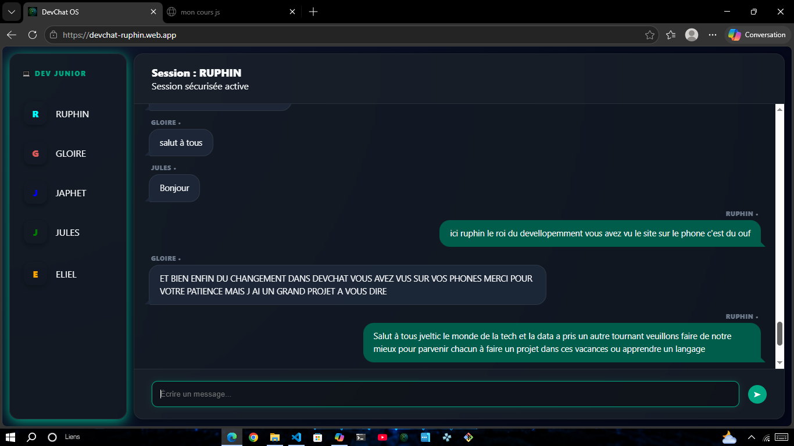

# DevChat 💬

> _“La technologie peut rapprocher les jeunes, même là où les moyens sont limités.”_  
> — Ruphin, 13 ans, passionné de programmation en RDC 🇨🇩

---

Un système de messagerie en temps réel développé par **Ruphin (13 ans, passionné de programmation en RDC)** et ses collaborateurs de l’équipe **JVLTIC** et de classe.  
Malgré les difficultés de notre pays, nous avons créé ce projet pour apprendre, collaborer et montrer que la technologie peut rapprocher les jeunes.

🌐 **Adresse du projet :** [https://devchat-ruphin.app.web](https://devchat-ruphin.app.web)

---

## 🖼️ Aperçu du projet



> Interface sécurisée et futuriste de DevChat OS 💬
> Devchat fonctionnnant avec la technologie _firebase de google_ connecté au serveur de frankfurt

---

## 🚀 Fonctionnalités

- Connexion sécurisée avec code d’accès
- Envoi et réception de messages en temps réel via **Firebase Firestore**
- Interface responsive adaptée aux petits écrans
- Gestion des utilisateurs (ADMINS)

---

## 🛠️ Installation

1. Clonez le dépôt :
   ```bash
   git clone https://github.com/tonpseudo/devchat.git
   ```
